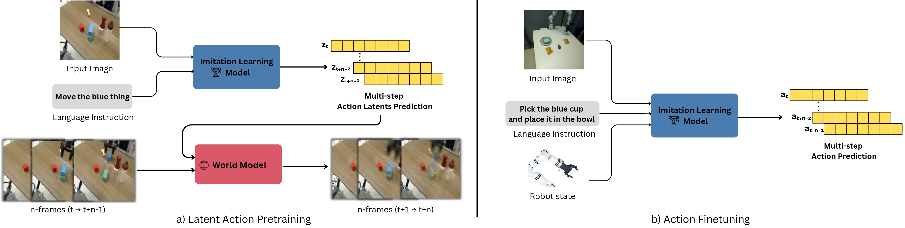
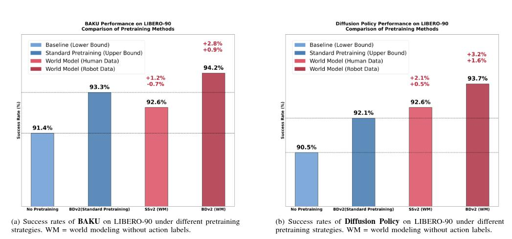

# Latent Action Pretraining Through World Modeling  
### Bahey Tharwat¹ · Yara Nasser² · Ali Abouzeid¹ · Ian Reid¹  

¹ Mohamed bin Zayed University of Artificial Intelligence (MBZUAI)  
² Alexandria University  


[](https://arxiv.org/abs/2509.18428)
[](https://yaranasserr.github.io/lawm-paper/)
[](LICENSE)

---

## Overview  
Vision‑Language‑Action (VLA) models have recently gained traction for learning robotic manipulation tasks from language instructions. Many state‑of‑the‑art approaches rely on large manually‑labelled action datasets collected via teleoperation. In this work, we propose a more scalable and efficient route: a **model‑agnostic framework** for *self-supervised pretraining* of imitation‑learning models by learning **latent action representations** from unlabeled video data through world‑modeling. These videos may originate from robot recordings or humans interacting with everyday objects.



Overview of **LAWM**, which consists of two stages : (a) Latent Action Pretraining, where an imitation learning model processes input images and natural language instructions to predict latent action representations zt:t+n. These are paired with video frames and optimized jointly with a world model in a self-supervised manner by predicting future frames, grounding the latent actions in environment dynamics without reliance on ground-truth actions. (b) Action Finetuning, where the pretrained imitation learning model is adapted to downstream robotic tasks using labeled demonstrations. Here,the model maps observations (images, language instructions, and robot state) directly to ground-truth actions at:t+n through supervised learning.

---

## Features  
- Learn latent action representations from unlabeled videos of object‑interactions (robotic or human)  
- Pretrain a world‑model-based backbone that supports downstream imitation learning  
- Efficient, practical for real‑world robotic use‑cases  

---

## Table of Contents  
- [Installation](#installation)  
- [Data Preprocessing](#data-preprocessing)  
  - [LIBERO](#libero)  
  - [Bridge Data v2](#bridge-data-v2)  
  - [Something‑Something v2](#something-something-v2)  
- [Training](#training)  
  - [Pretraining](#pretraining)  
  - [Finetuning](#finetuning)  
  - [Evaluation](#evaluation)  
- [Results](#results)  
- [Citation](#citation)  
- [License](#license)  
- [Acknowledgements](#acknowledgements)  

---

## Installation  
1. Clone the repo:  
   ```bash
   git clone https://github.com/baheytharwat/lawm.git
   cd lawm
   ```  
2. Create a conda (or virtualenv) environment and install dependencies:  
   ```bash
   conda create -n lawm python=3.10
   conda activate lawm
   pip install -r requirements.txt
   ```  
3. Download / prepare the datasets (see [Data Preprocessing](#data-preprocessing)).  
4. Run training, finetuning, or evaluation as described below.

---

## Data Preprocessing  
In this section we outline the preprocessing steps for each of the major datasets used in our work.
The data directory should be structured as follows:

```text
data/
  libero/
    libero_90/
    libero_10/
  bd/
    bdv2/
  ss/
    ssv2/
```

### LIBERO  
#### Install LIBERO
```bash
git clone https://github.com/Lifelong-Robot-Learning/LIBERO.git
cd LIBERO
pip install -e .
cd ..
```
#### LIBERO Data

First download the dataset. Note that our code base assumes the data is stored in a folder titled `data/` within the Adapt3r repository. If you would like to store it somewhere else please create a symlink. 

Download the data into `data/` by running
```bash
python scripts/download_libero.py
```
Note that this file renames the data such that, for LIBERO-90, it is stored in `data/libero/libero_90_unprocessed`

Then, process it into a format that is suitable for our training by running 
```bash
python scripts/process_libero_data.py  task=libero_90
```


#### BridgeData v2 Data
- We use the BridgeData v2 dataset of robotic demonstrations across multiple embodiments/environments for pretraining.  
Download `demos_8_17.zip` from [BridgeData v2](https://rail.eecs.berkeley.edu/datasets/bridge_release/data/) and extract it. Then run the code to preprocess the data to the required HDF5 format (similar to LIBERO preprocessing):

```bash
python scripts/prepare_bdv2.py \
  --input_dir {extraction_path}/raw/bridge_data_v2 \
  --output_dir data/bd/bdv2
```

#### Something‑Something v2 Data
- We incorporate the large video dataset Something‑Something v2 (human interactions) to broaden our unlabeled video pool.  
Download  the videos and labels from [Something-Something v2](https://www.qualcomm.com/developer/software/something-something-v-2-dataset/downloads), extract them, and then run the preprocessing script:

```bash
python scripts/prepare_ssv2.py \
  --input_dir {extraction_path}/something-something-v2 \
  --output_dir data/ss/ssv2
```

---

## Training  

### Pretraining  
To run the pretraining stage on unlabeled videos, Examples are:  
```bash
python scripts/train.py \
  --config-name=train_bdv2.yaml \
  task=bdv2 \
  algo=baku \
  algo/encoder=rgb \
  algo/aug=identity \
  algo.chunk_size=10 \
  exp_name=baku \
  variant_name=bdv2
```  
```bash
python scripts/train.py \
  --config-name=train_ssv2.yaml \
  task=ssv2 \
  algo=diffusion_policy \
  algo/encoder=rgb \
  algo/aug=identity \
  algo.chunk_size=16 \
  exp_name=diffusion_policy \
  variant_name=ssv2
```  


To train another policy, replace `algo` with the desired policy (options are `baku`, `diffusion_policy`, and `act`). `act` exists within the codebase, but not intergrated with the world model. replace `task` with the desired dataset (options are `bdv2`, `ssv2`, and `libero`).

`exp_name` and `variant_name` are used to organize your training runs. In particular, they determind where they are saved. Generally in our workflow, `exp_name` would refer to an experiment encompassing several runs while `variant_name` would be one configuration of parameters encompassing several seeds.

### Finetuning  
To finetune on libero tasks, Example:  
```bash
python scripts/train.py \
    --config-name=train.yaml \
    task=libero \
    algo=baku \
    algo/encoder=rgb  \
    algo/aug=image \
    algo.chunk_size=10 \
    exp_name=baku \
    variant_name=libero \
    checkpoint_path=experiments/ss/ssv2/baku/ssv2/multitask_model_epoch_0050.pth \
    init_from_pretrained=true \
```  
### Evaluation  
To evaluate on libero tasks, Example:  
```bash
python scripts/evaluate.py \
    task=libero \
    algo=baku \
    exp_name=baku \
    variant_name=libero \
    checkpoint_path=experiments/libero/baku/libero/multitask_model_epoch_0050.pth \
    seed=0
```  

## Results  

Pretraining on **BridgeData v2** and **Something-Something v2** using a **world model without action labels** (WM) outperforms supervised pretraining with ground-truth actions.  
This demonstrates that our latent-action world-model approach effectively captures transferable representations even without explicit action supervision.



**Key findings:**
- World-model pretraining (both human and robot data) exceeds supervised pretraining baselines.
- On LIBERO-90, **BAKU** achieves **94.2 %** success with BDv2 (WM), improving by up to **+2.8 %** over supervised pretraining.
- **Diffusion Policy** reaches **93.7 %** success with BDv2 (WM), surpassing the supervised baseline by **+3.2 %**.
- Indicates strong transfer and robust performance gains from world-model pretraining using unlabeled video data.


## Citation  
If you use this code or project, please cite:  
```
@article{tharwat2025latent,
  title={Latent Action Pretraining Through World Modeling},
  author={Tharwat, Bahey and Nasser, Yara and Abouzeid, Ali and Reid, Ian},
  journal={arXiv preprint arXiv:2509.18428},
  year={2025}
}
```

---

## License  
This project is released under the MIT License. See the [LICENSE](LICENSE) file for details.

---

## Acknowledgements  
This implementation builds upon and adapts the codebase of the [Adapt3R](https://github.com/pairlab/Adapt3R) project.  
We are grateful to the authors of Adapt3R for making their code publicly available.

---